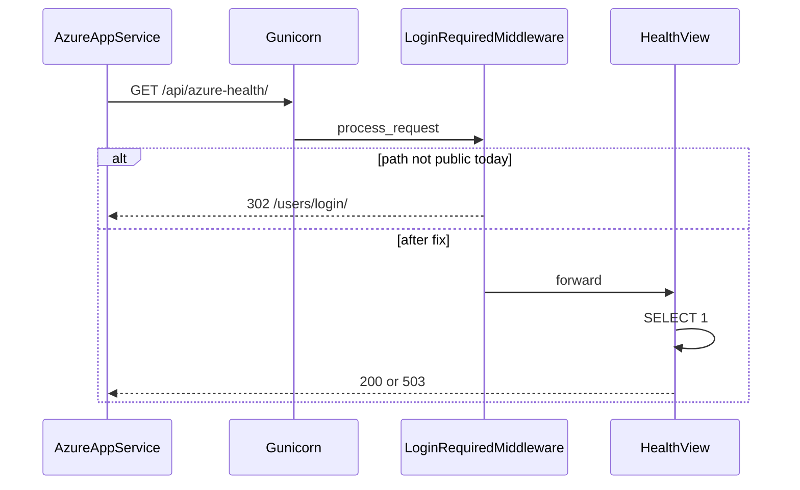

# Anonymous Azure Health Check Endpoint

## Problem

The project already exposes health URLs in [`STATZWeb/urls.py`](STATZWeb/urls.py):

- `/health/` — plain `HttpResponse("OK")`
- `/api/health-check/` — `JsonResponse({"status": "ok"})` (used by [`static/js/cert-checker.js`](static/js/cert-checker.js))

Neither path is in the [`LoginRequiredMiddleware`](STATZWeb/middleware.py) public allow-list. In production (`REQUIRE_LOGIN=True` by default in [`STATZWeb/settings.py`](STATZWeb/settings.py)), unauthenticated Azure probes are **redirected to login** (302), which App Service treats as unhealthy.



## Target behavior

| Path | Audience | Format | Success | Failure |
|------|----------|--------|---------|---------|
| `/api/azure-health/` | Azure App Service probe | JSON | `200` `{"status":"healthy","checks":{"database":"ok"}}` | `503` `{"status":"unhealthy","checks":{"database":"unavailable"}}` |
| `/health/` | Backward compatibility | `text/plain` | `200` body `OK` | `503` body `UNAVAILABLE` |

**Readiness rules (your choice):**
- Run `SELECT 1` via `django.db.connection` (same lightweight pattern as [`STATZWeb/system_test_utils.py`](STATZWeb/system_test_utils.py) `test_database_connection`, but **without** exposing DB host/name/version in the response).
- Catch all DB exceptions; log server-side only; never leak connection strings or stack traces to the client.
- `GET` only; set `Cache-Control: no-store`.

**Security constraints:**
- No auth, no session requirement, no company scoping — intentional for infra probes only.
- Do **not** reuse `run_system_tests()` — it returns environment/version details unsuitable for anonymous callers.
- Add only the two health paths (and optionally `/api/health-check/`) to the middleware allow-list — nothing broader.

## Implementation

### 1. Shared readiness logic in `core` app

[`core/views.py`](core/views.py) is empty; [`core`](core) is already the cross-cutting infrastructure app per repo conventions.

Add a small module, e.g. [`core/health.py`](core/health.py):

```python
def run_readiness_check() -> tuple[bool, dict[str, str]]:
    try:
        with connection.cursor() as cursor:
            cursor.execute("SELECT 1")
        return True, {"database": "ok"}
    except Exception:
        logger.exception("Health check: database unavailable")
        return False, {"database": "unavailable"}
```

Add two thin views in [`core/views.py`](core/views.py):
- `azure_health(request)` — JSON response for `/api/azure-health/`
- `health_plain(request)` — plain text for `/health/`

Both call `run_readiness_check()` and map result → status code.

### 2. Wire URLs in [`STATZWeb/urls.py`](STATZWeb/urls.py)

- Replace inline `health_check` function with import from `core.views.health_plain`.
- Add `path("api/azure-health/", core.views.azure_health, name="azure_health")`.
- Keep existing `path("health/", ...)` but point it at `health_plain` and retain `name="health_check"`.
- **Fix URL name collision:** rename the cert-checker route from `name="health_check"` to `name="api_health_check"` (only internal reverse name; path stays `/api/health-check/`). Grep shows no `reverse('health_check')` for the API path — cert-checker uses the hardcoded path.

### 3. Whitelist paths in [`STATZWeb/middleware.py`](STATZWeb/middleware.py)

Add to `LoginRequiredMiddleware.public_urls`:

```python
'/health/',
'/api/azure-health/',
```

**Recommended (small extra fix):** also add `'/api/health-check/'` so certificate verification in [`static/js/cert-checker.js`](static/js/cert-checker.js) works for anonymous users in production without a login redirect.

Optional performance tweak: add an early bypass at the top of `__call__` (alongside `/static/`, `/sw.js`) for paths starting with `/health` and `/api/azure-health` — avoids permission-resolution work on high-frequency probes. Not required for correctness.

`ReleaseNoteGateMiddleware` already skips unauthenticated requests — no change needed. `ActiveCompanyMiddleware` already no-ops for anonymous users.

### 4. Tests in [`core/tests.py`](core/tests.py)

Add focused tests (no need for full `training` suite scope):

- Anonymous `GET /api/azure-health/` returns `200` when DB is reachable (`@override_settings(REQUIRE_LOGIN=True)`).
- Force DB failure (mock `connection.cursor` to raise) → `503` and `status: unhealthy`.
- `GET /health/` returns `OK` / `UNAVAILABLE` consistently.
- Assert unauthenticated request is **not** redirected to login (status not 302).

### 5. Azure App Service configuration (manual, post-deploy)

In the App Service **Health check** blade (or `healthCheckPath` ARM/Bicep):

- Set path to **`/api/azure-health/`**
- Expect **200** for healthy instances; **503** removes instance from rotation

Document this in a one-line comment above the URL in `urls.py` or in [`PROJECT_CONTEXT.md`](PROJECT_CONTEXT.md) under infrastructure — whichever you prefer for ops visibility.

### 6. Verification

- `python manage.py check`
- `python manage.py test core` (new tests)
- Local smoke: `curl -i http://localhost:8000/api/azure-health/` logged out → `200`
- With `REQUIRE_LOGIN=True`, confirm no redirect to `/users/login/`

## Out of scope (unless you ask later)

- Release note markdown (infra-only; no user-facing UI change)
- Liveness-only `/health/live` split (you chose readiness only)
- Removing `/api/health-check/` or changing cert-checker JS
- Azure portal/IaC changes in-repo (no health check path config found in [`web.config`](web.config) or startup scripts)

## Files to touch

| File | Change |
|------|--------|
| [`core/health.py`](core/health.py) | New — readiness check helper |
| [`core/views.py`](core/views.py) | Azure + plain health views |
| [`STATZWeb/urls.py`](STATZWeb/urls.py) | Route wiring, remove inline `health_check` |
| [`STATZWeb/middleware.py`](STATZWeb/middleware.py) | Public URL allow-list |
| [`core/tests.py`](core/tests.py) | Anonymous + readiness tests |
